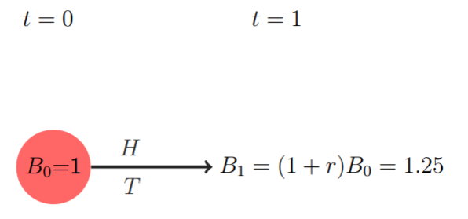
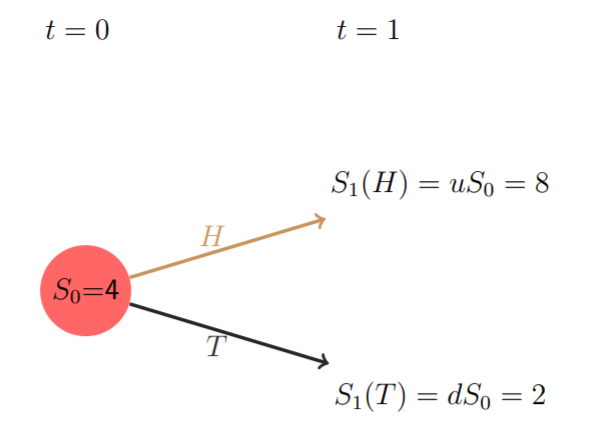
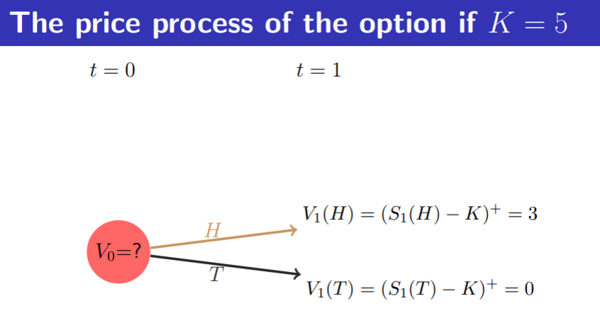

# 1. Intro

* 离散模型（Discrete-time models）
  * 单周期模型（single-period models）
  * 多周期模型（multi-period models）
* 连续模型（Continuous-time models）

多周期二叉树理论将连续模型离散化为离散模型

 

# 2. Financial Market

金融市场不同于商品市场。

**金融市场作用**：

资本的配置（allocation of resources），包括：

* **时间配置**（time） 明天的钱拿到今天来用
* **状态配置**（ states of nature）保险就是金融市场实现的不同状态下财富的转移和配置，不至于生活状态的大起大落

航空公司对冲（hedge against）燃油价格上涨导致公司破产的风险，可以事先买石油公司的期权。

**金融市场两大要素**：

* 不确定性（Uncertainty - **概率空间** Probability space）
* **金融产品**（Financial products/assets traded）

 

# 3.单周期二叉树模型

One-period binomial model

## 3.1概率空间

任何一个模型都离不开概率空间（不确定性），所以金融模型首先要确定出概率空间（probability space）：
$$
(\Omega,\mathcal{F},\mathbb{P})
$$
（Stochastic base 是在多周期期模型有用，有信息流，这门课不学）

对于二叉树模型来说：只有 t=0 和 t=1 两个时间点
$$
\Omega=\{H,T\}
$$
其中只有 $\mathcal{F}$ 是随机变量（$\Omega$ 不是随机变量）。$\mathcal{F}$ 是 $\Omega$ 的所有的子集（空集、全集、其他组合）
$$
\mathcal{F}=2^\Omega
$$

$$
0<\mathbb{P}(H)=p<1
$$

## 3.2金融产品

三种金融产品

### 3.2.1债券

无风险资产（risk-free asset ex. government **B**ond）

利率 $r>0$，债券价格 $B$：
$$
B_1 = B_0(1+r)
$$

### 3.2.2股票

**S**tock价格 $S$：
$$
\begin{aligned}
S_1(H)=uS_0\\\\
S_1(T)=dS_0
\end{aligned}
$$

$S_0$ 为已知量。

$S_1$ 随机变量，有上涨和下跌两种情况，幅度分别为$u$ 和 $d$。

### 3.2.3期权

期权（Option）是一种金融衍生品（derivative asset）。分为 REAL OPTION 和 FREE OPTION（缺货时给予的promise）。

衍生资产价格是 $V$，是关于 $S$ 的函数：
$$
V_1=(S_1-K)^+
$$
由于终止时刻的$S_1$和执行价格$K$都是已知的，所以衍生资产在终止时刻的价格是已知的。

（执行价格是不论将来期货价格涨得多高、跌得多深，买方都有权利以执行价格买入或卖出。）

但是衍生产品初始时刻的价格$V_0$并不知道，这就是我们要定价的。

（部分金融衍生品定价困难，甚至没有交易市场，如 exotic derivative 奇异衍生品）

定价基本原则是**无套利定价原则**

## 3.3简单期权定价

期权定价理论两个基本问题：

1. 期权定价问题
2. 对冲风险的投资组合构造

分析：在$t=0$时刻出售$V_0$元的期权，在$t=1$时刻需要返还$V_1$元。但是并不知道究竟是$\{H,T\}$当中的哪一种状态，为了对冲风险（hedge short position），需要确定债券和$\Delta_0$只股票的投资组合（portfolio），以满足：
$$
(V_0-\Delta_0S_0)(1+r)+\Delta_0S_1=V_1
$$
即：债券本加息+买得股票数目的钱=将来的期权价格

因为$V$有上涨和下跌两种情况，所以上面的式子就变成了两个式子：

$$
\begin{aligned}
\begin{cases}
(V_0-\Delta_0S_0)(1+r)+\Delta_0S_1(H)=V_1(H)\\\\
(V_0-\Delta_0S_0)(1+r)+\Delta_0S_1(T)=V_1(T)
\end{cases}
\end{aligned}
$$

根据公式$V_1(\Omega)=(S_1(\Omega)-K)^+$，$V_1$可以求出。所以要求解的未知量为： $V_0$ 和 $\Delta_0$ 。带入求解得：

$$
\begin{aligned}
\begin{cases}
V_0=\frac{1}{1+r}[\overset{\sim}{p}V_1(H)+(1-\overset{\sim}{p})V_1(T)],\space \overset{\sim}{p}=\frac{1+r-d}{u-d}\\\\
\Delta_0=\frac{V_1(H)-V_1(T)}{S_1(H)-S_1(T)}
\end{cases}
\end{aligned}
$$

在$V_0$的式子中不难发现其中反应了金融市场定价评估的两大要素：时间折扣和风险折扣：

* $\frac{1}{1+r}$代表时间的折扣
* $\overset{\sim}{p}V_1(H)+(1-\overset{\sim}{p})V_1(T)$代表风险折扣

风险折扣中用$\overset{\sim}{p}$而不用$p$的原因：

用$p$算出的期望并没有考虑方差，实际上大多数人不是风险中心的，而是风险厌恶的，因此引入$\overset{\sim}{p}$。

$u$ 和 $d$ 是股票上涨和下跌的比率。（$u$>$d$）

如果 $d<1+r<u$ 不成立，即 $p$ 不位于区间(0,1)，则有套利。原因：

* 如果$1+r\geqslant u$，卖出期权后买债券赚钱。
* 如果$1+r\leqslant d$，投资赚来的钱并不够偿还期权，需要向银行借钱，产生套利。

$\Delta_ 0$的式子也叫做 delta-hedging fomular。

由于有的时候$\Delta _0$没有解，就不可以对冲风险。

## 3.4套利

套利：Arbitrage

从无到有叫做套利，从一到二不叫套利

金融学中规定：如果向量中的每一个分量大于等于0，同时至少有一个分量严格大于零，则我们说这个向量大于零。

对于单周期二叉树模型：如果三个状态（初始、涨后、跌后）构成的向量$(P_0,P_1(H),P_1(T))$满足：
$$
(P_0,P_1(H),P_1(T)) > 0
$$
则产生套利。

（即 An arbitrage is a transaction that involves no negative cash flow at any probabilistic or temporal state and a positive cash flow in at least one state）

### 3.4.1套利的反向策略

如果算出的$V_0$与市场已定的$\bar{V_0}$不同，也会产生套利。通过举例解释原因：

假设$V_0=6$，$\bar{V_0}=8>V_0$

则可以通过卖出$\bar{V_ 0}$期权（+8），买入$V_0$期权（-6），在下一时刻两个期权的$V_1$相抵，在初始时刻赚2元。

假设$V_0=6$，$\bar{V_0}=3<V_0$

则可以反过来，通过卖出$V_ 0$期权（+6），买入$\bar{V_0}$期权（-3），在下一时刻两个期权的$V_1$相抵，在初始时刻赚3元。

### 3.4.2风险中性概率

$V_0$的式子也可以写成：
$$
V_0=\frac{1}{1+r}E^{\mathbb{\overset{\sim}{P}}}(V_1)
$$
$\overset{\sim}{\mathbb{P}}$ is called risk-neutral probability or risk-neutral probability measure.

 

# *

补充图片：

1. 
2. 
3. 
